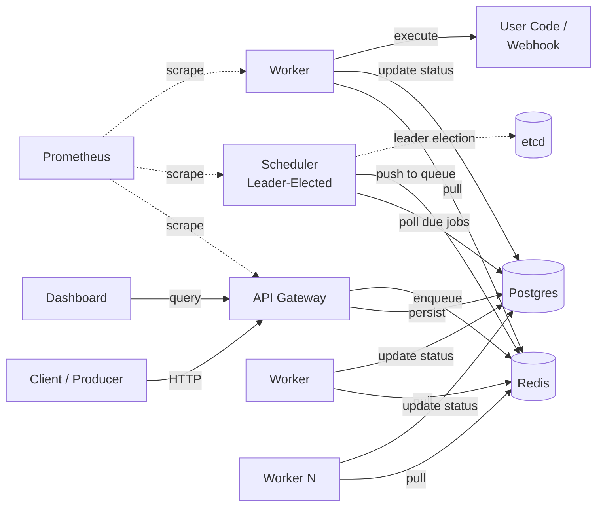

# Sluice

> A horizontally scalable, durable job scheduler written in Go. At-least-once delivery, exponential backoff, leader-elected HA, and a real dashboard.

[](https://golang.org)
[](LICENSE)
[](https://github.com/JoshBlazer/Sluice/actions/workflows/ci.yml)

Sluice is a from-scratch alternative to Sidekiq, Celery, or AWS SQS + EventBridge for teams that want the durability of a relational store, the throughput of an in-memory queue, and the operational simplicity of a single Go binary per role.

---

## Why Sluice?

Most teams reach for either a Redis-only queue (fast but loses jobs on crash) or a full workflow engine like Temporal (powerful but heavy). Sluice occupies the middle: Postgres as the durable source of truth, Redis as the hot path, and a clean separation between scheduling and execution.

- **Durable by default** — jobs survive crashes, network partitions, and worker death
- **High throughput** — designed for 10k+ jobs/sec on commodity hardware
- **At-least-once delivery** — with idempotency keys to deduplicate retries
- **Scheduler HA** — leader election via etcd, with hot standbys
- **Multi-tenant** — per-tenant rate limits and weighted fair queuing
- **Observable** — Prometheus metrics, OpenTelemetry traces, structured logs on every code path
- **Operable** — graceful shutdown, hot config reload, admin CLI for incident response

---

## Quick Start

```bash
# Spin up Postgres, Redis, etcd, Jaeger, and Prometheus
docker-compose up -d

# Submit a job
curl -X POST http://localhost:8080/v1/jobs \
  -H "Authorization: Bearer dev-token" \
  -H "Content-Type: application/json" \
  -d '{
    "type": "webhook",
    "payload": {"url": "https://example.com/hook", "method": "POST"},
    "max_retries": 5,
    "priority": 1,
    "idempotency_key": "order-1234"
  }'

# Schedule a job for the future
curl -X POST http://localhost:8080/v1/jobs \
  -H "Authorization: Bearer dev-token" \
  -H "Content-Type: application/json" \
  -d '{
    "type": "webhook",
    "payload": {"url": "https://example.com/reminder"},
    "run_at": "2026-01-15T10:00:00Z"
  }'

# Register a recurring job
curl -X POST http://localhost:8080/v1/schedules \
  -H "Authorization: Bearer dev-token" \
  -H "Content-Type: application/json" \
  -d '{
    "name": "nightly-cleanup",
    "cron": "0 2 * * *",
    "job_template": {
      "type": "webhook",
      "payload": {"url": "https://example.com/cleanup"}
    }
  }'

# Start the dashboard
cd web && npm install && npm run dev -- --port 3000
# open http://localhost:3000
```

Priority is an integer: `1` = high, `5` = normal, `10` = low.

---

## Architecture at a Glance



Full design and trade-offs are documented in [architecture.md](architecture.md).

---

## Features

### Job Types

| Type | Use Case | Example |
|------|----------|---------|
| Immediate | Run as soon as a worker is available | Webhook on order placed |
| Scheduled | Run at a specific future time | Send reminder at 9am tomorrow |
| Recurring | Run on a cron schedule | Nightly database cleanup |

### Reliability

- **At-least-once delivery** with visibility timeouts for crashed workers
- **Idempotency keys** — duplicate submissions return the original job
- **Exponential backoff with jitter** — configurable per job
- **Dead-letter queue** — jobs exhausting retries are quarantined for inspection
- **Worker heartbeats** — abandoned jobs return to the queue automatically

### Multi-Tenancy

- Per-tenant API keys
- Per-tenant rate limits (jobs/sec)
- Weighted fair queuing across tenants within each priority lane
- Per-tenant metrics

### Observability

- **Metrics**: queue depth, processing latency histogram, retry counts, worker health, throughput per tenant
- **Tracing**: distributed traces from API submission to job completion via OpenTelemetry + Jaeger
- **Logs**: structured JSON via `log/slog` with correlation IDs threaded through context
- **Dashboard**: real-time queue depth, recent runs, dead-letter inspection

### Operations

- **Graceful shutdown**: workers drain in-flight jobs before exiting (configurable timeout)
- **Hot config reload**: SIGHUP reloads tenant configs and rate limits without restart
- **Admin CLI**: replay dead-letter jobs, drain queues, force-fail stuck jobs, dump scheduler state
- **Backup-friendly**: Postgres is the source of truth; standard backup tooling applies

---

## Performance Targets

Design targets on a 3-node cluster (4 vCPU / 8 GB RAM each), Postgres 16, Redis 7:

| Metric | Target |
|--------|--------|
| Submission throughput | 10,000+ jobs/sec |
| End-to-end latency (p50) | < 10 ms (submit → pickup) |
| End-to-end latency (p99) | < 50 ms (submit → pickup) |
| Scheduler failover | < 2 seconds (leader → hot standby) |
| Recovery from full node loss | < 30 seconds (all in-flight jobs) |

---

## Tech Stack

**Language & Runtime**
- Go 1.25+ with `log/slog` and context-aware everything

**APIs & Communication**
- HTTP/REST via `chi`
- WebSocket subscriptions for dashboard live updates

**Storage & Coordination**
- PostgreSQL 16 (durable source of truth) via `pgx/v5`
- Redis 7 (hot queue) via `go-redis/v9`
- etcd v3 (leader election)

**Observability**
- Prometheus client library with custom collectors
- OpenTelemetry SDK exporting to Jaeger
- Structured JSON logs via `log/slog`

**Frontend**
- Next.js 14 + TypeScript
- TanStack Query
- Tailwind CSS + shadcn/ui
- Recharts

**Testing**
- `testing` (standard library) for unit tests
- Integration tests dial the docker-compose Postgres/Redis directly and skip if not reachable

**Deployment**
- Docker multi-stage builds
- Docker Compose for local development
- Kubernetes manifests + Helm chart
- GitHub Actions CI

---

## Project Structure

```
sluice/
├── cmd/
│   ├── sluice/            # Single binary — run with --role api|scheduler|worker
│   └── sluice-cli/        # Admin CLI
├── internal/
│   ├── api/              # HTTP handlers, middleware, WebSocket
│   ├── scheduler/        # Scheduling, cron, leader election
│   ├── worker/           # Worker loop, executor, heartbeats
│   ├── storage/          # Postgres queries (hand-written pgx)
│   ├── queue/            # Redis queue abstraction
│   ├── job/              # Domain types, state machine
│   ├── tenant/           # Multi-tenancy context
│   ├── ratelimit/        # Fixed-window rate limiter per tenant
│   └── telemetry/        # Metrics, tracing, logging
├── migrations/           # SQL migrations (golang-migrate)
├── web/                  # Next.js dashboard
├── deploy/
│   ├── docker/
│   ├── k8s/
│   └── helm/
└── architecture.md       # Detailed design doc
```

---

## Development

### Prerequisites

- Go 1.25+
- Docker + Docker Compose
- `migrate` CLI: `go install -tags 'pgx5' github.com/golang-migrate/migrate/v4/cmd/migrate@latest`
- Node 20+ (for the dashboard)

### Local Setup

```bash
# Clone and install tools
git clone https://github.com/JoshBlazer/Sluice
cd jobit
make bootstrap        # installs migrate, downloads Go modules

# Start infrastructure
make up               # postgres, redis, etcd, jaeger, prometheus

# Apply migrations
make migrate-up

# Run each role in separate terminals
make dev-api
make dev-scheduler
make dev-worker

# Dashboard
cd web && npm install && npm run dev
```

### Common Tasks

```bash
make test             # unit + integration tests
make lint             # go vet
make migrate-up       # apply DB migrations
make docker-build     # build the Docker image
```

---

## Testing

Two tiers:

1. **Unit tests** — pure logic, no I/O. Run in < 5 seconds. `make test-unit`
2. **Integration tests** — dial Postgres and Redis directly; skip gracefully if the stack isn't up. Run locally with `make up && make migrate-up && make test-integration`. `make test-integration`

CI runs both on every push and pull request against real Postgres 16 and Redis 7 service containers.

---

## Deployment

### Docker Compose (single host)

```bash
docker-compose -f deploy/docker/docker-compose.prod.yml up -d
```

### Kubernetes

```bash
helm install sluice deploy/helm/sluice \
  --set postgres.password=$PG_PASSWORD \
  --set workers.replicas=10
```

Recommended production layout:

- 2× API replicas (stateless, load-balanced)
- 3× Scheduler replicas (1 leader + 2 hot standbys via etcd lease)
- 10× Worker replicas (scaled by HPA on queue depth)
- 1× Postgres primary + 1 replica
- 1× Redis with persistence + 1 replica
- 3× etcd nodes

---

## Admin CLI

```bash
# Re-enqueue a dead-letter job
sluice-cli replay <job-id>

# Mark a stuck job as dead immediately
sluice-cli force-fail <job-id>

# Flush all Redis queues (jobs stay in Postgres, reconciler re-enqueues when ready)
sluice-cli drain

# Show job counts, active workers, upcoming schedules, and queue depths
sluice-cli dump-scheduler

# List the 50 most recent dead-letter entries
sluice-cli list-dead
```

---

## Roadmap

- [x] Core API, scheduler, worker with at-least-once delivery
- [x] Cron + delayed jobs
- [x] Leader election + scheduler HA
- [x] Multi-tenancy with weighted fair queuing
- [x] Dashboard with real-time updates
- [x] OpenTelemetry tracing
- [ ] Job DAGs with dependency resolution
- [ ] WASM-based custom job types (sandboxed user code)
- [ ] Kafka source for event-driven job submission
- [ ] Native Kubernetes operator

---

## License

MIT — see [LICENSE](LICENSE).
