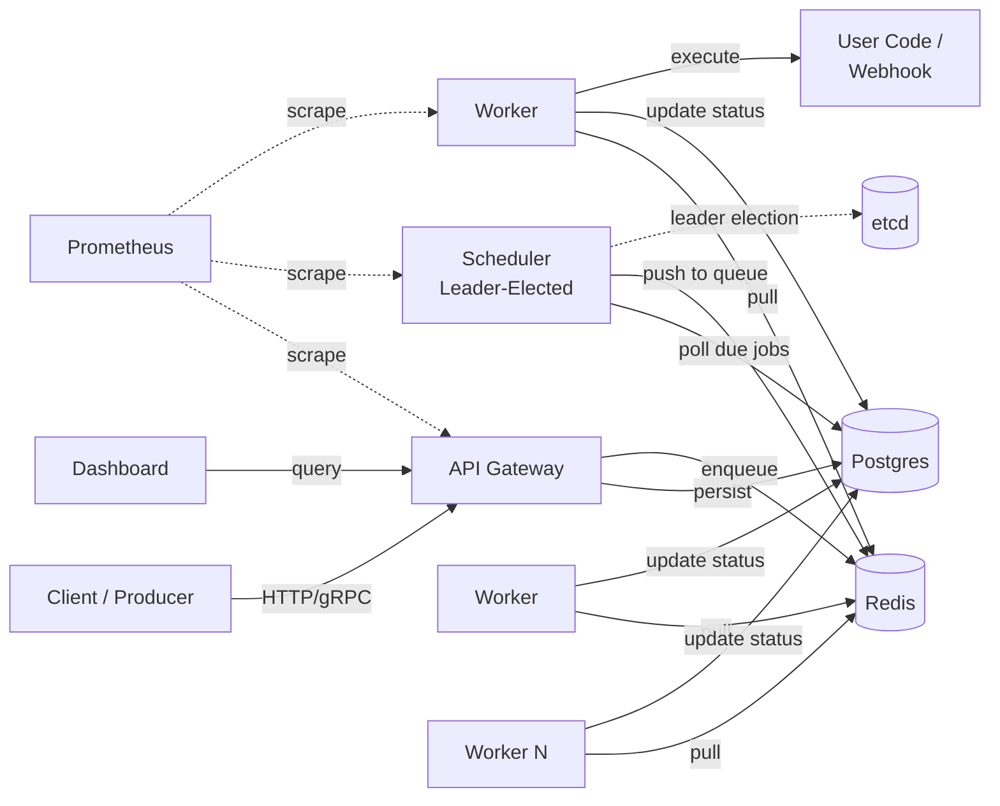

# Pulse

> A horizontally scalable, durable job scheduler written in Go. At-least-once delivery, exponential backoff, leader-elected HA, and a real dashboard.

[](https://golang.org)
[](LICENSE)
[](.)
[](.)

Pulse is a from-scratch alternative to Sidekiq, Celery, or AWS SQS + EventBridge for teams that want the durability of a relational store, the throughput of an in-memory queue, and the operational simplicity of a single Go binary per role.

---

## Why Pulse?

Most teams reach for either a Redis-only queue (fast but loses jobs on crash) or a full workflow engine like Temporal (powerful but heavy). Pulse occupies the middle: Postgres as the durable source of truth, Redis as the hot path, and a clean separation between scheduling and execution.

- **Durable by default** — jobs survive crashes, network partitions, and worker death
- **High throughput** — designed for 10k+ jobs/sec on commodity hardware
- **At-least-once delivery** — with idempotency keys to deduplicate retries
- **Scheduler HA** — leader election via etcd, with hot standbys
- **Multi-tenant** — per-tenant rate limits and fair queuing
- **Observable** — Prometheus metrics, OpenTelemetry traces, structured logs on every code path
- **Operable** — graceful shutdown, hot config reload, admin CLI for incident response

---

## Quick Start

```bash
# Spin up the full stack: Postgres, Redis, etcd, API, scheduler, workers, dashboard
docker-compose up -d

# Submit a job
curl -X POST http://localhost:8080/v1/jobs \
  -H "Authorization: Bearer dev-token" \
  -H "Content-Type: application/json" \
  -d '{
    "type": "webhook",
    "payload": {"url": "https://example.com/hook", "method": "POST"},
    "max_retries": 5,
    "priority": "high",
    "idempotency_key": "order-1234"
  }'

# Schedule a job for the future
curl -X POST http://localhost:8080/v1/jobs \
  -H "Authorization: Bearer dev-token" \
  -H "Content-Type: application/json" \
  -d '{
    "type": "webhook",
    "payload": {"url": "https://example.com/reminder"},
    "run_at": "2026-01-15T10:00:00Z"
  }'

# Register a recurring job
curl -X POST http://localhost:8080/v1/schedules \
  -H "Authorization: Bearer dev-token" \
  -H "Content-Type: application/json" \
  -d '{
    "name": "nightly-cleanup",
    "cron": "0 2 * * *",
    "job_template": {
      "type": "webhook",
      "payload": {"url": "https://example.com/cleanup"}
    }
  }'

# Open the dashboard
open http://localhost:3000
```

---

## Architecture at a Glance



Full architectural details, design decisions, and trade-offs are documented in **[docs/architecture.md](docs/architecture.md)**.

---

## Features

### Job Types

| Type | Use Case | Example |
|------|----------|---------|
| Immediate | Run as soon as a worker is available | Webhook on order placed |
| Scheduled | Run at a specific future time | Send reminder at 9am tomorrow |
| Recurring | Run on a cron schedule | Nightly database cleanup |
| DAG | Run when dependencies complete | ETL pipeline stages |

### Reliability

- **At-least-once delivery** with visibility timeouts for crashed workers
- **Idempotency keys** — duplicate submissions within a window return the original job
- **Exponential backoff with jitter** — configurable per job or per type
- **Dead-letter queue** — jobs exhausting retries are quarantined for inspection
- **Worker heartbeats** — abandoned jobs return to the queue automatically

### Multi-Tenancy

- Per-tenant API keys with scoped permissions
- Per-tenant rate limits (jobs/sec, concurrent executions)
- Weighted fair queuing across tenants within each priority lane
- Per-tenant metrics and dashboards

### Observability

- **Metrics**: queue depth, processing latency (histogram), retry counts, worker health, throughput per tenant
- **Tracing**: distributed traces from API submission to job completion via OpenTelemetry
- **Logs**: structured JSON via `log/slog` with correlation IDs threaded through context
- **Dashboard**: real-time queue depth, recent runs, retry histories, dead-letter inspection

### Operations

- **Graceful shutdown**: workers drain in-flight jobs before exiting (configurable timeout)
- **Hot config reload**: SIGHUP reloads tenant configs, rate limits, and feature flags without restart
- **Admin CLI**: replay dead-letter jobs, drain workers, force-fail stuck jobs, dump scheduler state
- **Backup-friendly**: Postgres is the source of truth; standard backup tooling applies

---

## Performance Targets

Benchmarked on a 3-node cluster (4 vCPU / 8 GB RAM each), Postgres 16, Redis 7:

| Metric | Target | Notes |
|--------|--------|-------|
| Submission throughput | 15,000 jobs/sec | Sustained, via gRPC |
| End-to-end latency (p50) | 8 ms | Submit → pickup |
| End-to-end latency (p99) | 47 ms | Submit → pickup |
| Worker capacity | 5,000 concurrent | Per worker process |
| Scheduler failover | < 2 seconds | Leader → hot standby |
| Recovery from full node loss | < 30 seconds | All in-flight jobs |

Full benchmark methodology, hardware specs, and reproducible scripts in [docs/benchmarks.md](docs/benchmarks.md).

---

## Tech Stack

**Language & Runtime**
- Go 1.22+ with `log/slog`, `sync/errgroup`, and context-aware everything

**APIs & Communication**
- HTTP/REST via `chi`
- gRPC via `google.golang.org/grpc` + protobuf
- WebSocket subscriptions for dashboard live updates

**Storage & Coordination**
- PostgreSQL 16 (durable source of truth) via `pgx/v5`
- Redis 7 (hot queue + locks) via `go-redis/v9`
- etcd v3 (leader election) — optional, with in-process Raft as alternative

**Observability**
- Prometheus client library with custom collectors
- OpenTelemetry SDK exporting to Jaeger/Tempo
- Structured JSON logs via `log/slog`

**Frontend**
- Next.js 14 + TypeScript
- TanStack Query
- Tailwind CSS + shadcn/ui
- Recharts

**Testing**
- `testing` (standard library) for unit
- `testcontainers-go` for integration (real Postgres + Redis)
- `toxiproxy` for chaos / network partition tests
- `rapid` for property-based tests
- `k6` for load tests

**Deployment**
- Docker multi-stage builds (final image < 20MB via `distroless/static`)
- Docker Compose for local development
- Kubernetes manifests + Helm chart
- GitHub Actions CI

---

## Project Structure

```
pulse/
├── cmd/
│   ├── api/              # API server entrypoint
│   ├── scheduler/        # Scheduler entrypoint
│   ├── worker/           # Worker entrypoint
│   └── pulse-cli/        # Admin CLI
├── internal/
│   ├── api/              # HTTP + gRPC handlers
│   ├── scheduler/        # Scheduling, cron, leader election
│   ├── worker/           # Worker loop, executor, heartbeats
│   ├── storage/          # Postgres queries (sqlc-generated)
│   ├── queue/            # Redis queue abstraction
│   ├── job/              # Domain types, state machine
│   ├── tenant/           # Multi-tenancy logic
│   ├── ratelimit/        # Token bucket per tenant
│   └── telemetry/        # Metrics, tracing, logging
├── proto/                # Protobuf definitions
├── migrations/           # SQL migrations (golang-migrate)
├── web/                  # Next.js dashboard
├── deploy/
│   ├── docker/
│   ├── k8s/
│   └── helm/
├── docs/
│   ├── architecture.md   # Detailed design doc
│   ├── benchmarks.md     # Performance methodology
│   ├── operations.md     # Runbook
│   └── decisions/        # Architecture Decision Records
└── scripts/              # Dev and ops helpers
```

---

## Development

### Prerequisites

- Go 1.22+
- Docker + Docker Compose
- `migrate` CLI (`brew install golang-migrate`)
- `protoc` + Go plugins for proto generation
- Node 20+ (for the dashboard)

### Local Setup

```bash
# Clone and bootstrap
git clone https://github.com/yourname/pulse
cd pulse
make bootstrap        # installs tools, generates proto, runs migrations

# Run the full stack with hot reload
make dev              # uses air for live reload

# Or run components individually
go run ./cmd/api
go run ./cmd/scheduler
go run ./cmd/worker
cd web && npm run dev
```

### Common Tasks

```bash
make test             # unit + integration tests
make test-chaos       # chaos tests via toxiproxy
make bench            # load benchmarks via k6
make lint             # golangci-lint with strict config
make migrate-up       # apply DB migrations
make proto            # regenerate protobuf code
make docker-build     # build all images
```

---

## Testing

The test suite has four tiers:

1. **Unit tests** — pure logic, no I/O. Run in < 5 seconds. `make test-unit`
2. **Integration tests** — real Postgres + Redis via testcontainers. Run in < 90 seconds. `make test-integration`
3. **Chaos tests** — inject network partitions, kill workers mid-job, corrupt connections. `make test-chaos`
4. **Load tests** — k6 scripts validating throughput and latency targets. `make bench`

Coverage threshold is 80% for `internal/` packages; CI blocks PRs that drop below.

---

## Deployment

### Docker Compose (single host)

```bash
docker-compose -f deploy/docker/docker-compose.prod.yml up -d
```

### Kubernetes

```bash
helm install pulse deploy/helm/pulse \
  --set postgres.password=$PG_PASSWORD \
  --set workers.replicas=10
```

Recommended layout for production:

- 2× API replicas (stateless, load-balanced)
- 3× Scheduler replicas (1 leader + 2 hot standbys, via etcd lease)
- 10× Worker replicas (scaled by HPA on queue depth)
- 1× Postgres primary + 1 replica
- 1× Redis with persistence + 1 replica
- 3× etcd nodes

See [docs/operations.md](docs/operations.md) for the full runbook.

---

## Roadmap

- [x] Core API, scheduler, worker with at-least-once delivery
- [x] Cron + delayed jobs
- [x] Leader election + scheduler HA
- [x] Multi-tenancy with fair queuing
- [x] Dashboard with real-time updates
- [x] OpenTelemetry tracing
- [ ] Job DAGs with dependency resolution
- [ ] WASM-based custom job types (sandboxed user code)
- [ ] Kafka source for event-driven job submission
- [ ] Native Kubernetes operator

---

## License

MIT — see [LICENSE](LICENSE).

## Acknowledgments

Influenced by Sidekiq, Temporal, River Queue, AWS SQS, and the [eth-infinitism reference implementations](https://github.com/eth-infinitism). Particular thanks to the authors of `pgx`, `chi`, and the OpenTelemetry Go SDK.
