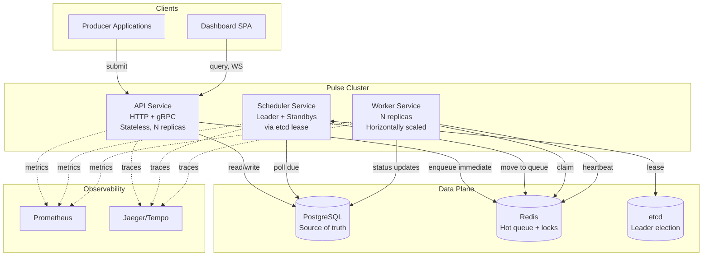
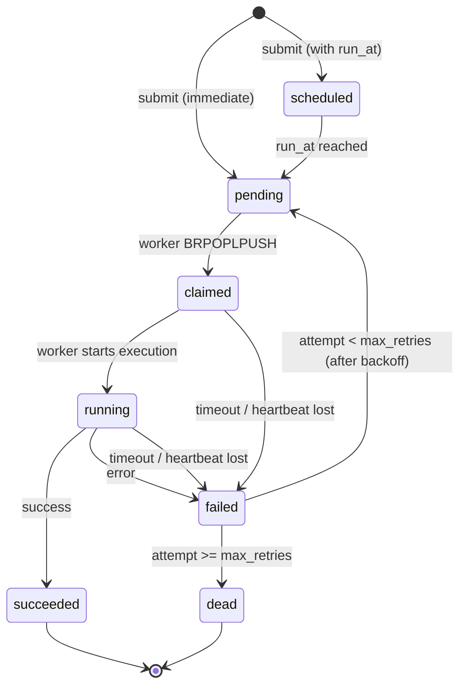

# Pulse Architecture

This document describes the internal design of Pulse — what each component does, why it exists, the guarantees it provides, and the trade-offs we accepted to get there.

## Table of Contents

1. [Design Principles](#design-principles)
2. [System Components](#system-components)
3. [Data Model](#data-model)
4. [Job Lifecycle](#job-lifecycle)
5. [Reliability Guarantees](#reliability-guarantees)
6. [Concurrency & Coordination](#concurrency--coordination)
7. [Multi-Tenancy & Fairness](#multi-tenancy--fairness)
8. [Failure Modes](#failure-modes)
9. [Scaling Considerations](#scaling-considerations)
10. [Trade-offs & Alternatives Considered](#trade-offs--alternatives-considered)

---

## Design Principles

The design follows four principles, in order of priority when they conflict:

**Durability before performance.** A job that's been accepted by the API must survive any single-node failure. We use Postgres as the system of record and only acknowledge submission after the row is committed. Performance optimizations (Redis, in-memory caches) are layered on top but never replace the durable record.

**Boring storage, interesting logic.** We use a battle-tested relational database for state, not a bespoke storage engine. The interesting engineering goes into scheduling, fairness, and failure handling — not into rewriting B-trees.

**Make failure visible.** Every retry, timeout, and dead-letter event is recorded with context. Operators should never have to wonder why a job is stuck.

**Single binary, multiple roles.** The same Go binary runs as `api`, `scheduler`, or `worker` based on a command flag. This keeps the build simple, avoids the divergence problem of polyglot services, and lets us share code (especially the storage layer) across roles.

---

## System Components



### API Service

The API service is the only ingress. It exposes:

- **HTTP/REST** for human-friendly integration (curl, Postman, simple clients)
- **gRPC** for high-throughput producers needing low latency and streaming
- **WebSocket** for the dashboard to subscribe to live job state changes

Responsibilities:
- Authenticate requests (JWT-based, per-tenant API keys)
- Validate job payloads against tenant-specific schemas
- Enforce per-tenant rate limits (token bucket in Redis)
- Persist the job to Postgres (this is the durability boundary)
- For immediate jobs: push the job ID to the appropriate Redis queue
- For scheduled/cron jobs: leave it in Postgres for the scheduler to pick up
- Serve read queries for the dashboard

The API is fully stateless. Any replica can handle any request. Scaling is horizontal behind a load balancer.

### Scheduler Service

The scheduler is the only stateful-by-position component. It has multiple replicas, but exactly one is the active leader at any moment, elected via an etcd lease with a 5-second TTL and 1.5-second renewal interval.

The leader's responsibilities:

1. **Due-job polling**: every 100ms, query Postgres for scheduled jobs whose `run_at` ≤ now and push them to Redis. Uses a `SELECT ... FOR UPDATE SKIP LOCKED` pattern to be safe even if a second leader briefly exists during failover.

2. **Cron expansion**: every minute, evaluate all active recurring schedules. For each schedule whose next-run-time has passed, create a new job row and either enqueue immediately or schedule for the future.

3. **Visibility timeout reaping**: every 5 seconds, scan for jobs in the `claimed` or `running` state whose worker heartbeat has expired. Return them to the queue (incrementing the retry counter).

4. **Dead-letter promotion**: jobs that exceed their max_retries get moved from active tables to the `dead_letter` table for inspection.

Non-leader replicas are hot standbys. They keep their database connection pool warm and run periodic health checks against Postgres and Redis. On lease loss by the current leader, the next standby promotes typically within 1.5 seconds.

### Worker Service

Workers are stateless and horizontally scalable. The worker loop:

```
forever:
  job = redis.BRPOPLPUSH(queue, processing_queue, timeout=5s)
  if job:
    claim_token = uuid.v4()
    if !postgres.try_claim(job.id, claim_token, deadline=now+timeout+30s):
      continue  # someone else got it, or it's been canceled

    redis.SET(heartbeat_key(job.id), claim_token, EX=15s)
    start_heartbeat_goroutine(job.id, claim_token)

    result = execute(job)

    postgres.complete(job.id, claim_token, result)
    redis.LREM(processing_queue, job.id)
    stop_heartbeat()
```

Key properties:
- The Postgres `try_claim` is the source of truth for ownership. Redis is fast but not authoritative.
- The `claim_token` ensures a worker that comes back from the dead (e.g., GC pause, network blip) can't accidentally complete a job that's been reassigned.
- Heartbeats happen in a separate goroutine on a 5-second interval against a 15-second TTL. This gives 3 missed heartbeats before reassignment.

---

## Data Model

### Core Tables

```sql
-- Jobs in flight or terminal
CREATE TABLE jobs (
    id              UUID PRIMARY KEY,
    tenant_id       UUID NOT NULL,
    type            TEXT NOT NULL,
    payload         JSONB NOT NULL,
    priority        SMALLINT NOT NULL DEFAULT 5,  -- 1=high, 5=normal, 10=low
    state           job_state NOT NULL DEFAULT 'pending',
    run_at          TIMESTAMPTZ NOT NULL DEFAULT NOW(),
    claimed_at      TIMESTAMPTZ,
    claimed_by      TEXT,                          -- worker ID
    claim_token     UUID,
    deadline        TIMESTAMPTZ,                   -- visibility timeout
    attempt         INT NOT NULL DEFAULT 0,
    max_retries     INT NOT NULL DEFAULT 3,
    backoff_seconds INT NOT NULL DEFAULT 30,
    idempotency_key TEXT,
    last_error      TEXT,
    created_at      TIMESTAMPTZ NOT NULL DEFAULT NOW(),
    completed_at    TIMESTAMPTZ,
    
    CONSTRAINT idempotency_unique
        UNIQUE (tenant_id, idempotency_key)
);

CREATE TYPE job_state AS ENUM (
    'pending',     -- in queue, awaiting worker
    'scheduled',   -- waiting for run_at
    'claimed',     -- worker has it but not started
    'running',     -- worker is executing
    'succeeded',   -- terminal
    'failed',      -- will retry
    'dead'         -- terminal, exhausted retries
);

-- Indexes for scheduler queries
CREATE INDEX idx_jobs_scheduled 
    ON jobs (run_at, priority) 
    WHERE state = 'scheduled';

CREATE INDEX idx_jobs_in_flight 
    ON jobs (deadline) 
    WHERE state IN ('claimed', 'running');

CREATE INDEX idx_jobs_tenant_recent 
    ON jobs (tenant_id, created_at DESC);
```

```sql
-- Recurring schedules
CREATE TABLE schedules (
    id              UUID PRIMARY KEY,
    tenant_id       UUID NOT NULL,
    name            TEXT NOT NULL,
    cron            TEXT NOT NULL,
    timezone        TEXT NOT NULL DEFAULT 'UTC',
    job_template    JSONB NOT NULL,
    enabled         BOOLEAN NOT NULL DEFAULT TRUE,
    last_run_at     TIMESTAMPTZ,
    next_run_at     TIMESTAMPTZ NOT NULL,
    
    UNIQUE (tenant_id, name)
);

CREATE INDEX idx_schedules_due ON schedules (next_run_at) WHERE enabled = TRUE;
```

```sql
-- Historical runs for observability (partitioned by month)
CREATE TABLE job_runs (
    id              UUID PRIMARY KEY,
    job_id          UUID NOT NULL,
    tenant_id       UUID NOT NULL,
    attempt         INT NOT NULL,
    started_at      TIMESTAMPTZ NOT NULL,
    finished_at     TIMESTAMPTZ,
    state           job_state NOT NULL,
    error           TEXT,
    duration_ms     INT
) PARTITION BY RANGE (started_at);
```

```sql
-- Dead-letter queue
CREATE TABLE dead_letter (
    job_id          UUID PRIMARY KEY,
    tenant_id       UUID NOT NULL,
    moved_at        TIMESTAMPTZ NOT NULL DEFAULT NOW(),
    final_error     TEXT,
    attempt_count   INT NOT NULL,
    original_job    JSONB NOT NULL  -- full snapshot for replay
);
```

### Redis Keys

```
queue:{tenant_id}:{priority}     LIST    job IDs awaiting workers
processing:{worker_id}           LIST    jobs currently held by a worker
heartbeat:{job_id}               STRING  TTL-based heartbeat (15s)
dedupe:{tenant_id}:{idem_key}    STRING  job ID for idempotency (24h TTL)
ratelimit:{tenant_id}            STRING  token bucket state
```

The principle: every entry in Redis can be reconstructed from Postgres in case of Redis loss. Redis is purely a performance layer.

---

## Job Lifecycle



The transitions are explicit in the schema (`state` column) and audited in the `job_runs` table. Every state change increments a Prometheus counter labeled with `tenant_id`, `job_type`, and `outcome`.

---

## Reliability Guarantees

### At-Least-Once Delivery

Pulse guarantees that an accepted job will be executed at least once. Duplicates can occur in the following scenarios:

- **Worker crashes mid-execution**: heartbeat expires, scheduler reassigns to another worker
- **Network partition between worker and Postgres**: worker completes locally but cannot record success; job is reassigned
- **Slow execution exceeding visibility timeout**: another worker may pick it up

Job authors must design for this. The system provides three mechanisms to help:

1. **Idempotency keys at submission time** — duplicate submissions deduplicate
2. **Per-job claim tokens** — a stale worker cannot accidentally mark a reassigned job as complete
3. **Attempt counter exposed to job code** — handlers can short-circuit on retry if needed

We chose at-least-once over exactly-once because exactly-once delivery in distributed systems requires either (a) transactional guarantees with the downstream system (rarely possible) or (b) two-phase commit (expensive). At-least-once + idempotent handlers is the industry-standard pragmatic answer.

### Durability

Job acceptance is durable: when the API returns 200 OK to a submission, the job has been committed to Postgres with `synchronous_commit=on`. The job will survive any single-node failure of any component in the cluster.

### Ordering

Pulse does **not** guarantee FIFO ordering within a queue. Workers pull concurrently, retries are reordered by backoff, and the scheduler may batch operations. Applications requiring ordering should use job DAGs or carry sequence numbers in their payload.

---

## Concurrency & Coordination

### Leader Election

Scheduler replicas race to acquire a 5-second TTL etcd lease at the key `/pulse/scheduler/leader`. The winner becomes leader. The leader renews the lease every 1.5 seconds. On loss of lease (process death, network partition, GC pause > 5s), another standby takes over.

We chose etcd over alternatives because:

- **Postgres advisory locks** would work but conflate the data plane with the coordination plane — a database hiccup would affect scheduling
- **Redis-based locks (Redlock)** have well-documented correctness issues for leader election specifically
- **Building Raft into the scheduler** is satisfying but adds complexity not justified by the scale we target

The scheduler is designed to be resilient to brief periods of dual leadership (the "split-brain" of a leader pausing for 5+ seconds while a new leader is elected). The use of `SELECT FOR UPDATE SKIP LOCKED` for due-job polling means two leaders cannot both claim the same job.

### Worker Coordination

Workers don't coordinate with each other directly. They coordinate through:

- **Redis queue** for work distribution (one worker pops each entry)
- **Postgres claim** for ownership (only one worker can hold the claim token at a time)
- **Heartbeat key** for liveness (other workers see the heartbeat is alive and don't try to reclaim)

This shared-nothing pattern is what enables horizontal scaling.

---

## Multi-Tenancy & Fairness

Each tenant has:

- A unique `tenant_id`
- One or more API keys with scoped permissions (submit, query, admin)
- A configurable rate limit (jobs/sec submitted) enforced via a Redis token bucket
- A configurable concurrency limit (max concurrent running jobs) enforced via a Postgres counter

Within a priority lane, queue selection uses **weighted round-robin** across active tenants. Each tenant has a weight (default 100); when a worker pops from the queue, the worker iterates tenants in proportion to their weight. This prevents one tenant from monopolizing workers.

A noisy tenant can saturate their own concurrency limit, but their backlog doesn't slow down other tenants — their queue grows, but workers continue serving others.

---

## Failure Modes

| Failure | Detection | Response |
|---------|-----------|----------|
| Worker process crash | Heartbeat expires (15s) | Job reassigned to another worker |
| Worker network partition | Heartbeat expires | Job reassigned; original worker self-fences via claim token mismatch |
| Scheduler leader crash | etcd lease expires (5s) | Standby promotes; due-job polling resumes |
| Postgres primary failure | Connection errors | API returns 503; producers retry; failover to replica when available |
| Redis failure | Queue operations fail | API/workers gracefully degrade; scheduler can re-populate from Postgres |
| etcd unavailable | Lease renewal fails | Current leader continues until lease expires; then no scheduling until etcd returns |
| Disk full on Postgres | Write failure | API returns 503; existing in-flight jobs continue |
| Clock skew | None automatic | Document NTP requirement; scheduler logs warnings on > 1s skew |

The system is designed so that loss of **Redis or etcd is recoverable** without data loss. Loss of Postgres is the only data-loss scenario, and that's why Postgres replication is documented as required for production.

---

## Scaling Considerations

### Horizontal Scaling

- **API**: stateless, scale linearly. Bottlenecked by Postgres write throughput at extreme scale.
- **Workers**: stateless, scale linearly with workload. Bottlenecked by Postgres claim throughput (~10k claims/sec on commodity hardware).
- **Scheduler**: leader-elected, doesn't scale horizontally. Bottleneck is rare — even at 100k jobs/sec submissions, the scheduler only polls due jobs, which is much smaller.

### Vertical Scaling

- **Postgres**: usually the first bottleneck. Strategies: connection pooling via PgBouncer, partitioning the `job_runs` table by month (already in schema), promoting common queries to materialized views.
- **Redis**: cluster mode for > 100k ops/sec.

### Sharding

For very large deployments (> 1M jobs/sec), the natural shard key is `tenant_id`. The system architecture supports this: each tenant could route to a dedicated Pulse cluster with its own Postgres. Currently not implemented — single-cluster scaling is sufficient for the target use cases.

---

## Trade-offs & Alternatives Considered

### Postgres vs. Kafka as source of truth

We chose Postgres because:
- Relational queries (dashboard, search, debugging) are first-class
- Idempotency keys are easy to enforce with `UNIQUE` constraints
- Tooling, backups, and monitoring are mature
- Most teams already operate Postgres

Kafka would offer higher submission throughput and natural ordering but loses on queryability and operational simplicity.

### Embedded Raft vs. etcd for coordination

We chose external etcd because:
- It removes a class of subtle bugs from our codebase
- etcd is operated independently and can be shared across multiple services
- Implementing Raft is a great learning exercise but adds maintenance burden

An embedded Raft implementation (via `hashicorp/raft`) is provided as an opt-in alternative, primarily for teams that want zero external dependencies.

### Pull-based vs. push-based workers

Workers pull from Redis rather than the scheduler pushing to workers. This was chosen because:
- Pull naturally handles backpressure (slow workers pull slower)
- The scheduler doesn't need to track worker capacity
- Workers can be scaled without scheduler reconfiguration

The downside is slightly higher latency than push (one extra round-trip per job). At our latency targets, this is negligible.

### Single binary vs. multiple services

The same Go binary runs as API, scheduler, or worker via `--role` flag. This was chosen because:
- 80% of the code (storage, types, telemetry) is shared
- Single binary is easier to deploy and version
- No serialization mismatch risk between services

The cost is a slightly larger binary and longer compile time, both acceptable.

---

## Further Reading

- [docs/operations.md](operations.md) — runbook for production deployments
- [docs/benchmarks.md](benchmarks.md) — performance methodology and results
- [docs/decisions/](decisions/) — Architecture Decision Records (ADRs)

For questions about specific design choices, see the ADRs or open an issue.
